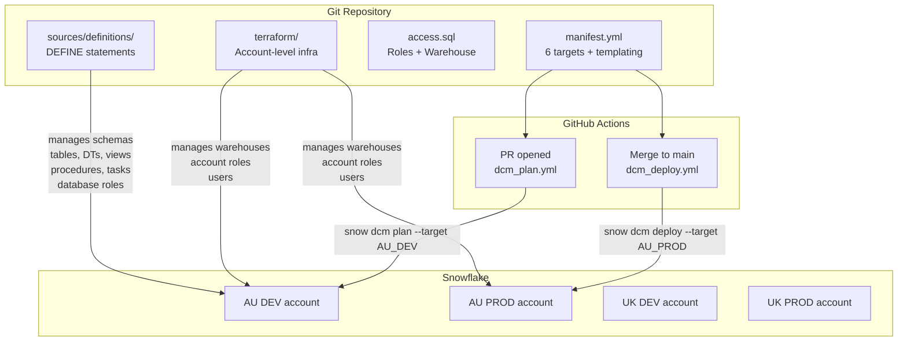

# Workshop Demo Plan: Infrastructure as Code with Snowflake

## Context

**Environment**: Snowflake CLI 3.19.0 (fully supported). Working directory: `CoCo_DE_DEMO`.

**Existing assets:**

- `dcm_project/` — fully built single-target DCM project managing a medallion pipeline (Bronze → Silver → Gold). Manifest has one DEV target pointing to `COCO_DE_DEMO.DCM.PIPELINE_PROJECT` on `SFSEAPAC-AU_DEMO70`. No roles, warehouses, or multi-env templating.
- `sql/` — imperative CREATE statements for all objects (perfect raw material for the AI-assisted conversion demo in Section 6).
- No GitHub Actions workflows or Terraform files currently exist.

**Demo strategy**: Extend COCO\_DE\_DEMO. The existing DEV target remains live and deployable throughout the demo; new targets are added to illustrate the multi-account story without disrupting the working pipeline.

---

## Architecture Overview



**DCM vs Terraform separation for Section 5:**

| Layer                | Managed by | Examples                                                             |
| -------------------- | ---------- | -------------------------------------------------------------------- |
| Account-level infra  | Terraform  | Warehouses, account roles, users, network policies, SCIM             |
| Database-level infra | DCM        | Schemas, tables, views, DTs, procedures, tasks, database roles, DMFs |

---

## Implementation Steps

### Task 1 — Expand `dcm_project/manifest.yml` to 6 targets

Replace the current single-target manifest with 6 targets grouped by region and environment. The existing AU\_DEV target keeps `COCO_DE_DEMO.DCM.PIPELINE_PROJECT` so the live demo deploy still works.

```yaml
manifest_version: 2
type: DCM_PROJECT
default_target: 'AU_DEV'

targets:
  AU_DEV:
    account_identifier: SFSEAPAC-AU_DEMO70
    project_name: 'COCO_DE_DEMO.DCM.PIPELINE_PROJECT'
    project_owner: ACCOUNTADMIN
    templating_config: 'DEV'
  AU_STAGING:
    account_identifier: SFSEAPAC-AU_DEMO70
    project_name: 'COCO_DE_DEMO.DCM.PIPELINE_PROJECT_STG'
    project_owner: ACCOUNTADMIN
    templating_config: 'STAGING'
  AU_PROD:
    account_identifier: SFSEAPAC-AU_PROD    # replace with real identifier
    project_name: 'COCO_DE_DEMO.DCM.PIPELINE_PROJECT'
    project_owner: PIPELINE_DEPLOYER
    templating_config: 'PROD'
  UK_DEV:
    account_identifier: SFSEAPAC-UK_DEMO70  # replace with real identifier
    project_name: 'COCO_DE_DEMO.DCM.PIPELINE_PROJECT'
    project_owner: ACCOUNTADMIN
    templating_config: 'DEV'
  UK_STAGING:
    account_identifier: SFSEAPAC-UK_DEMO70
    project_name: 'COCO_DE_DEMO.DCM.PIPELINE_PROJECT_STG'
    project_owner: ACCOUNTADMIN
    templating_config: 'STAGING'
  UK_PROD:
    account_identifier: SFSEAPAC-UK_PROD    # replace with real identifier
    project_name: 'COCO_DE_DEMO.DCM.PIPELINE_PROJECT'
    project_owner: PIPELINE_DEPLOYER
    templating_config: 'PROD'

templating:
  defaults:
    wh_size: 'XSMALL'
    env_suffix: '_DEV'
  configurations:
    DEV:
      wh_size: 'XSMALL'
      env_suffix: '_DEV'
    STAGING:
      wh_size: 'SMALL'
      env_suffix: '_STG'
    PROD:
      wh_size: 'LARGE'
      env_suffix: ''
```

**Demo talking point**: AU\_DEV and AU\_STAGING share the same account but must have different `project_name` values (a DCM constraint). AU\_PROD and UK\_PROD can share the same `project_name` because they are on different accounts.

---

### Task 2 — Create `dcm_project/sources/definitions/access.sql`

Add roles and a warehouse using the three-tier pattern from the `roles-and-grants` skill. Use `{{ wh_size }}` to link the definition to the manifest's templating block — this makes the connection between manifest templating and definitions visible during the demo.

```sql
-- Warehouse (size driven by manifest templating)
DEFINE WAREHOUSE COCO_DE_DEMO.PIPELINE_WH
    WITH WAREHOUSE_SIZE = '{{ wh_size }}'
    AUTO_SUSPEND = 60
    AUTO_RESUME = TRUE
    COMMENT = 'Pipeline compute — size controlled per environment';

-- Account role for warehouse access (database roles cannot hold warehouse grants)
DEFINE ROLE PIPELINE_WAREHOUSE_USER
    COMMENT = 'Warehouse access for COCO_DE_DEMO pipeline users';

GRANT USAGE ON WAREHOUSE COCO_DE_DEMO.PIPELINE_WH TO ROLE PIPELINE_WAREHOUSE_USER;
GRANT ROLE PIPELINE_WAREHOUSE_USER TO ROLE SYSADMIN;

-- Three-tier database roles
DEFINE DATABASE ROLE COCO_DE_DEMO.ANALYST
    COMMENT = 'Read-only access to Gold and Silver layers';

DEFINE DATABASE ROLE COCO_DE_DEMO.DEVELOPER
    COMMENT = 'Read/write access for pipeline engineers';

DEFINE DATABASE ROLE COCO_DE_DEMO.ADMIN
    COMMENT = 'Full DDL access for project administrators';

-- Role hierarchy (lower roles inherit upward)
GRANT DATABASE ROLE COCO_DE_DEMO.ANALYST TO DATABASE ROLE COCO_DE_DEMO.DEVELOPER;
GRANT DATABASE ROLE COCO_DE_DEMO.DEVELOPER TO DATABASE ROLE COCO_DE_DEMO.ADMIN;
GRANT DATABASE ROLE COCO_DE_DEMO.ADMIN TO ROLE SYSADMIN;

-- Schema usage
GRANT USAGE ON DATABASE COCO_DE_DEMO TO DATABASE ROLE COCO_DE_DEMO.ANALYST;
GRANT USAGE ON SCHEMA COCO_DE_DEMO.SILVER TO DATABASE ROLE COCO_DE_DEMO.ANALYST;
GRANT USAGE ON SCHEMA COCO_DE_DEMO.GOLD   TO DATABASE ROLE COCO_DE_DEMO.ANALYST;
GRANT USAGE ON SCHEMA COCO_DE_DEMO.BRONZE TO DATABASE ROLE COCO_DE_DEMO.DEVELOPER;

-- Object grants
GRANT SELECT ON ALL TABLES IN SCHEMA COCO_DE_DEMO.SILVER TO DATABASE ROLE COCO_DE_DEMO.ANALYST;
GRANT SELECT ON ALL TABLES IN SCHEMA COCO_DE_DEMO.GOLD   TO DATABASE ROLE COCO_DE_DEMO.ANALYST;
GRANT INSERT, UPDATE, DELETE ON ALL TABLES IN SCHEMA COCO_DE_DEMO.BRONZE TO DATABASE ROLE COCO_DE_DEMO.DEVELOPER;
GRANT CREATE TABLE, CREATE VIEW ON SCHEMA COCO_DE_DEMO.BRONZE TO DATABASE ROLE COCO_DE_DEMO.ADMIN;
GRANT CREATE TABLE, CREATE VIEW ON SCHEMA COCO_DE_DEMO.SILVER TO DATABASE ROLE COCO_DE_DEMO.ADMIN;
GRANT CREATE TABLE, CREATE VIEW ON SCHEMA COCO_DE_DEMO.GOLD   TO DATABASE ROLE COCO_DE_DEMO.ADMIN;
```

**Note**: `DEFINE WAREHOUSE` uses a `WITH` clause — requires loading `reference/primitives/warehouses.md` during implementation for exact syntax validation.

---

### Task 3 — Create `.github/workflows/dcm_plan.yml`

Triggers on PRs to `main` when `dcm_project/**` files change. Posts the plan summary as a PR comment so reviewers see exactly what will change in Snowflake.

**Required GitHub Secrets**: `SNOWFLAKE_ACCOUNT`, `SNOWFLAKE_USER`, `SNOWFLAKE_PRIVATE_KEY` (RSA PEM, passphrase-less).

```yaml
name: DCM Plan

on:
  pull_request:
    branches: [main]
    paths: ['dcm_project/**']

jobs:
  plan:
    runs-on: ubuntu-latest
    permissions:
      pull-requests: write

    steps:
      - uses: actions/checkout@v4

      - name: Install Snowflake CLI
        run: pip install snowflake-cli

      - name: Configure Snowflake connection
        run: |
          mkdir -p ~/.snowflake
          cat > ~/.snowflake/connections.toml <<EOF
          [ci]
          account   = "${{ secrets.SNOWFLAKE_ACCOUNT }}"
          user      = "${{ secrets.SNOWFLAKE_USER }}"
          private_key_path = "/tmp/sf_key.pem"
          EOF
          printf '%s' "${{ secrets.SNOWFLAKE_PRIVATE_KEY }}" > /tmp/sf_key.pem
          chmod 600 /tmp/sf_key.pem

      - name: DCM Plan
        working-directory: dcm_project
        run: snow dcm plan COCO_DE_DEMO.DCM.PIPELINE_PROJECT -c ci --target AU_DEV --save-output

      - name: Post plan summary as PR comment
        if: always()
        uses: actions/github-script@v7
        with:
          script: |
            const fs = require('fs');
            const result = JSON.parse(
              fs.readFileSync('dcm_project/out/plan/plan_result.json', 'utf8')
            );
            const ops = result.ddlChangeLog?.operations ?? [];
            const lines = ops.map(o =>
              `- **${o.operationType}** ${o.objectDomain}: \`${o.objectIdentifier ?? o.objectName}\``
            );
            const body = result.status === 'SUCCESS'
              ? `### DCM Plan\n\n${lines.length ? lines.join('\n') : '_No changes_'}`
              : `### DCM Plan FAILED\n\`\`\`\n${result.error}\n\`\`\``;
            github.rest.issues.createComment({
              owner: context.repo.owner,
              repo: context.repo.repo,
              issue_number: context.issue.number,
              body
            });
```

---

### Task 4 — Create `.github/workflows/dcm_deploy.yml`

Triggers on push to `main` (i.e., after PR merge) when `dcm_project/**` changes. Uses `--alias` set to the short commit SHA for deployment history tracking.

```yaml
name: DCM Deploy

on:
  push:
    branches: [main]
    paths: ['dcm_project/**']

jobs:
  deploy:
    runs-on: ubuntu-latest

    steps:
      - uses: actions/checkout@v4

      - name: Install Snowflake CLI
        run: pip install snowflake-cli

      - name: Configure Snowflake connection
        run: |
          mkdir -p ~/.snowflake
          cat > ~/.snowflake/connections.toml <<EOF
          [ci]
          account   = "${{ secrets.SNOWFLAKE_ACCOUNT }}"
          user      = "${{ secrets.SNOWFLAKE_USER }}"
          private_key_path = "/tmp/sf_key.pem"
          EOF
          printf '%s' "${{ secrets.SNOWFLAKE_PRIVATE_KEY }}" > /tmp/sf_key.pem
          chmod 600 /tmp/sf_key.pem

      - name: DCM Deploy
        working-directory: dcm_project
        run: |
          ALIAS="deploy-$(echo $GITHUB_SHA | head -c 7)"
          snow dcm deploy COCO_DE_DEMO.DCM.PIPELINE_PROJECT \
            -c ci --target AU_DEV --alias "$ALIAS"
```

---

### Task 5 — Create `terraform/` hybrid example

Directory structure:

```
terraform/
├── README.md                        # DCM vs Terraform boundary explanation
├── provider.tf                      # Snowflake provider config (v0.98+)
├── modules/
│   ├── snowflake_warehouses/
│   │   ├── main.tf                  # snowflake_warehouse resource
│   │   └── variables.tf
│   └── snowflake_account_roles/
│       ├── main.tf                  # snowflake_role + snowflake_role_grants
│       └── variables.tf
└── environments/
    ├── dev/
    │   ├── main.tf                  # calls modules, AU_DEV settings
    │   └── terraform.tfvars         # wh_size=XSMALL
    └── prod/
        ├── main.tf                  # calls modules, AU_PROD settings
        └── terraform.tfvars         # wh_size=LARGE
```

`terraform/README.md` content outlines the boundary:

> **Terraform owns**: account-level warehouses, service account roles, user provisioning, network policies, SSO/SCIM integrations — anything that exists before or outside a specific database.
>
> **DCM owns**: schemas, tables, views, dynamic tables, stored procedures, task DAGs, database roles, data quality expectations — everything inside a database.
>
> The handoff point: Terraform creates PIPELINE\_WH and PIPELINE\_DEPLOYER role; DCM's `access.sql` grants USAGE on that warehouse to the project roles.

**`terraform/modules/snowflake_warehouses/main.tf`** example:

```hcl
resource "snowflake_warehouse" "pipeline" {
  name           = var.warehouse_name
  warehouse_size = var.warehouse_size
  auto_suspend   = 60
  auto_resume    = true
  comment        = "Managed by Terraform — size: ${var.warehouse_size}"
}
```

---

### Task 6 — Create `WORKSHOP_DEMO_SCRIPT.md`

A presenter-ready guide covering all 7 agenda sections. Structure per section:

| Field          | Content                        |
| -------------- | ------------------------------ |
| Timing         | Allocated minutes + cumulative |
| What to show   | Specific file/command/screen   |
| Talking points | 3–5 key messages               |
| Commands       | Exact copy-paste CLI commands  |
| Transition     | Bridge to next section         |

**Section 6 (AI-Assisted IaC) walkthrough:**

- Open `sql/03_bronze_tables.sql` — shows imperative `CREATE TABLE` statements
- In CoCo, type: `/dcm` and then "Convert the CREATE TABLE statements in sql/03\_bronze\_tables.sql to DCM DEFINE statements"
- Walk through how CoCo auto-generates `bronze_tables.sql`-style definitions with CHANGE\_TRACKING and DATA\_METRIC\_SCHEDULE
- Key message: teams can migrate existing SQL scripts to DCM without manually rewriting everything

---

## Verification

After implementation, verify by:

1. `snow dcm raw-analyze COCO_DE_DEMO.DCM.PIPELINE_PROJECT -c default --target AU_DEV` — should report all objects including the new PIPELINE\_WH and database roles with no errors.
2. `snow dcm plan COCO_DE_DEMO.DCM.PIPELINE_PROJECT -c default --target AU_DEV --save-output` — read `out/plan/plan_result.json` and confirm PIPELINE\_WH and roles appear as CREATE operations (new objects).
3. Confirm `.github/workflows/` YAML parses correctly: `python -c "import yaml; yaml.safe_load(open('.github/workflows/dcm_plan.yml'))"`.
4. Verify Terraform files parse: `terraform -chdir=terraform/environments/dev init` (dry-run; no real credentials needed just to validate HCL syntax).

---

## Critical Files

- `dcm_project/manifest.yml` — expand from 1 to 6 targets with templating block
- `dcm_project/sources/definitions/access.sql` — new file: warehouse + roles
- `.github/workflows/dcm_plan.yml` — new file: CI plan on PR
- `.github/workflows/dcm_deploy.yml` — new file: CD deploy on merge
- `WORKSHOP_DEMO_SCRIPT.md` — new file: presenter guide
